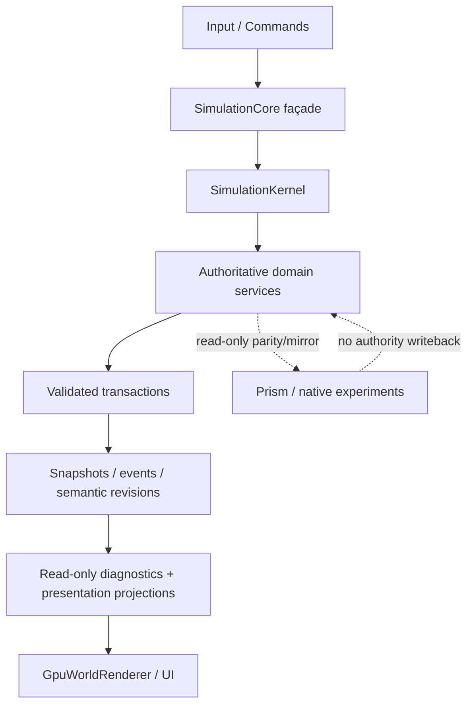

# Stack 8 — Architecture Baseline, Failure Map & Hardening Contracts

**Baseline:** `main@6e1b98704635c1c66927453f458cdc6b4ad6877b`  
**Scope:** Debugging, observability, deterministic reproduction, transaction architecture, integrity, lifecycle and architecture enforcement.  
**Persistence:** Save V9 / `0.9.0-urban-fabric` unchanged.  
**Authority:** No gameplay authority transfer. Prism remains non-authoritative.

## Component map

| Component | Owns | Reads | Writes | Mutates Through | Snapshot | Restore | Revision Source | RNG | Persistence Owner | Renderer Visible? |
|---|---|---|---|---|---|---|---|---|---|---|
| `SimulationCore` | Public gameplay/compatibility façade | All exposed domains | Delegated commands only | Domain APIs + accepted transaction seams | Whole-city authoritative checkpoint for rollback/diagnostics | Whole-city authoritative checkpoint restore | Delegated | None directly | Save façade | Yes, as read source |
| `SimulationKernel` | Clock, deterministic scheduling, commands, event journal, RNG registry, invariants, perf hooks | Registered system contracts | Orchestration state only | Scheduler/command bus | Kernel checkpoint | Kernel checkpoint restore | Tick + registries | `RandomStreamRegistry` | Save domains, not kernel diagnostics | No direct dependency |
| `WorldFoundation` | Physical/geographic world | Scenario/world config | Physical geography operations | Domain methods | V8/V9 payload | Hydration | Domain-owned | Namespaced world streams | Save V8/V9 | Yes, read-only |
| `CadastralGraph` | Legal parcel topology, easements, lineage | World/roads where supplied | Parcel topology | `CadastralMutationSystem` / runtime mutation service | `CadastralSnapshot` | `replaceSnapshot` | Semantic cadastre changes | None | Save V9 | Yes, read-only |
| `LotSystem` | Legacy lot compatibility projection only | Cadastre | Derived legacy lots | `rebuildFromCadastre` | Derived/compatibility snapshot where required | Rebuild/restore compatibility state | Cadastre/legacy edit | None | Inherited save compatibility | Yes |
| Parcel zoning | Dimensional parcel assignments | Cadastre/catalog | Parcel zoning assignments | Zoning domain methods / mutation service | Domain snapshot | Domain restore | Parcel assignment changes | None | Save V9 | Yes |
| `BuildingSystem` | Legacy buildings + canonical `BuildingV2` stores | Parcels/zoning/development inputs | Building stores | Building/development services | Legacy + V2 snapshots | Restore APIs | Building mutations | Domain streams where used upstream | Save V9 | Yes |
| Property market | Live parcel holdings + transaction history | Parcels/lineage | Holdings/transactions | `PropertyMarketSystem` | Property snapshot | Domain restore | Property mutations | None currently | Save V9 | Yes |
| Transportation graph | Transitional road projection | Roads | Derived graph/indexes | Rebuild from road authority | Projection/save compatibility | Projection load/rebuild | `RoadSystem.revision` | None | Existing save envelope | Yes |
| Traffic | Active vehicles, traffic metrics/outcomes | Transportation graph, intersections | Traffic authority | `TrafficSystem` | `TrafficStateSnapshot` | `restoreState` | `congestionEpoch` | Traffic stream via callers | Existing save envelope | Yes |
| Transit/mobility | Stops, lines, passenger queues, transit vehicles | Transport + service config | Transit/mobility state | Transit/mobility domain APIs | Existing snapshots | Existing restores | Domain state | Mobility streams | Existing save envelope | Yes |
| Services | Facilities, dispatch jobs, service vehicles | Roads/buildings | Service authority | Service APIs | Existing snapshots | Existing restores | Domain state | Incident/service streams | Existing save envelope | Yes |
| Economy/firms | Firms, production, inventories, orders, freight | Buildings/transport/demand | Economy/freight authority | Economy domain APIs | Existing snapshots | Existing restores | Domain state | Economy/freight streams | Existing save envelope | Yes |
| Persistence | Save envelope validation + hydration sequencing | Authoritative domain snapshots | New core during hydration | Versioned save modules | Save V9 | V9 hydration | Save version 9 | None | `src/save` | No |
| `GpuWorldRenderer` | GPU/presentation state only | Public simulation reads | Presentation caches only | Renderer APIs | Rebuildable | Rebuildable | Presentation-local only | Presentation randomness may not affect authority | None | N/A |
| Prism/native mirrors | Experimental/parallel verification only | Exported projections where approved | No TypeScript authority | Explicit mirror/parity seams | Tool-specific | Tool-specific | Non-authoritative | Tool-specific | None unless separately approved | Not authoritative |
| Stack 8 diagnostics | Failure metadata, trace, repro bundles, performance summaries | Public snapshots/checkpoints | Diagnostic state only | Narrow diagnostics services | Deterministic diagnostic payloads | Replay helper inputs | Reads authority revisions | **No simulation RNG** | None | Optional dev tooling only |

## Integration boundary map

| Boundary | Current Contract | Failure Mode | Existing / Stack 8 Test | Observability | Transactional? | Risk |
|---|---|---|---|---|---|---|
| Cadastre → property/buildings | Live parcel IDs must resolve; retired history requires lineage | Dangling refs, identity churn, partial rewrite | cadastral mutation suites + Stack 0 rollback + Stack 8 reference primitives | structured reference failures + authority hash | Yes for accepted runtime mutation seam | Critical |
| Roads/topology → cadastre | Legacy edits may require protected cadastral rebuild | Legal identity/history loss | Stack 0 stabilization suites | structured topology/compatibility failure substrate | Whole-operation checkpoint on façade | Critical |
| Roads/topology → traffic/transit/services | Derived routes/indexes must invalidate deterministically | Stale routes, orphan queues, hidden order dependence | transport suites + scheduler/revision tests | revisions, trace, kernel manifest | Domain-specific | High |
| Development → building/economy/housing | Award must commit all-or-nothing | Partial award, duplicated/stranded economic state | Stack 0 transaction coverage + permanent matrix | transaction rollback count + repro bundle | Yes at accepted checkpoint boundary | High |
| Freight → inventory | Cargo must conserve through delivery/cancel paths | Goods disappear on overflow/cancel | existing Stack 0 fixes + conservation regressions | structured conservation category available | Domain-specific | High |
| Bulldoze → building/economy/housing/services | Cross-domain deletion must be atomic | Partial demolition | Stack 0 rollback regression | rollback count + deterministic checkpoint | Yes at public façade boundary | High |
| Save payload → runtime | Validate before exposing hydrated live state | Duplicate IDs, dangling refs, NaN, partial hydration | Save V9 adversarial suite + Stack 8 continuation test | deterministic paths/messages + diagnostic wrapper substrate | Candidate-first hydration | High |
| Kernel system → kernel tick | Later failure must not leave earlier writes committed | Partial tick | `stack0-kernel-rollback` + Stack 8 failure/perf tests | structured `SchedulingFailure`, rollback count | Yes | High |
| Simulation → renderer | Presentation reads authority; no writeback | Renderer creates/mutates game fact | architecture firewall tests | architecture checker with source/alternative | Not applicable; renderer excluded | High |
| Diagnostics → simulation | Diagnostics must be observational | RNG consumption, behavior perturbation | Stack 8 authority-hash/trace tests | authority hash equality | Never a mutation participant | High |

## Multi-domain transaction audit

| Operation | Domains Mutated | Transaction Required? | Current Rollback | Stack 8 Contract | Regression Evidence |
|---|---|---:|---|---|---|
| Kernel tick | Clock, command/event/RNG infra + registered authoritative participant(s) | Yes | Stack 0 whole-city checkpoint | Participant coordinator captures deterministically; reverse rollback; rollback failure fail-stop | Stack 0 + `stack8-debugging-architecture.test.ts` |
| Road build | roads, cadastre compatibility, downstream state through rebuild | Yes | Whole-city checkpoint in `SimulationCore.buildRoad` | Accepted checkpoint remains; diagnostics expose rollback/failure | Stack 0 road/cadastre suites |
| Zoning paint | zoning + possible cadastral compatibility rebuild | Yes | Whole-city checkpoint | Same | Stack 0 zoning/cadastre suites |
| Bulldoze | building/road/zone + economy/housing/service consequences | Yes | Whole-city checkpoint | Same | Stack 0 bulldoze rollback suites |
| Cadastral split/assembly/ROW/easement | cadastre, zoning, buildings, property, derived lots | Yes | `CadastralRuntimeMutationService` staged transaction | Domain-owned transaction remains authoritative | Existing cadastral runtime mutation tests |
| Development award | building/economy/housing/developer state | Yes | Stack 0 checkpoint/rollback path | Diagnostics/repro can capture failure | Existing Stack 0 development rollback |
| Freight delivery/cancel | freight + inventories | Yes/conservation-safe | Domain-specific accepted fixes | Structured conservation failure category + regression matrix | Existing freight tests |
| Transit failure recovery | vehicle + passenger queues | Conservation transaction semantics | Existing accepted recovery behavior | Trace/repro substrate | Existing transit failure tests |

The generic `TransactionCoordinator` deliberately owns no domain semantics. Domain owners supply `snapshot()` and `restore()`. Participant IDs are unique, capture order is lexicographically stable, rollback runs in reverse capture order, and a rollback exception becomes a fail-stop `TransactionFailure`.

## Structured failure taxonomy

Stack 8 introduces stable categories:

- `InvariantViolation`
- `ReferenceIntegrityFailure`
- `TransactionFailure`
- `HydrationFailure`
- `DeterminismFailure`
- `SchedulingFailure`
- `TopologyReconciliationFailure`
- `ConservationFailure`
- `RendererSynchronizationFailure`
- `AssetRuntimeFailure`
- `CompatibilityBoundaryFailure`
- `ExternalRuntimeFailure`

`EngineFailure` carries stable code/category/domain/operation/tick and optional command IDs, entity IDs, revisions, save version, and causal parent operation. Local programmer exceptions are not mechanically replaced everywhere; orchestration/diagnostic seams normalize failures where machine-readable architecture context is useful.

## Deterministic reproduction contract

A Stack 8 repro bundle contains only deterministic payload fields:

- bundle version;
- game/save version;
- starting tick;
- starting authoritative checkpoint hash;
- ordered command records;
- named RNG stream states;
- scheduler manifest;
- semantic revisions;
- expected failure code and pre-failure authority hash when applicable;
- optional invariant/performance diagnostics.

Object keys are canonically sorted. Arrays retain semantic order. Wall-clock timestamps, local file paths and random UUIDs are excluded. Non-finite numbers and unsupported/cyclic values are rejected. Reproduction succeeds only when the failure code and pre-failure authority hash match the bundle expectation.

## Scheduler contract

Kernel systems now support explicit declarations for:

- system ID;
- cadence + dependencies/order;
- authoritative read domains;
- authoritative write domains;
- named RNG streams consumed;
- emitted event types;
- expected invariants;
- optional performance budget.

The existing deterministic DAG compiler remains the authority for execution order and continues to reject undeclared write/write and read/write ambiguity when overlapping cadences make order material. The stable scheduler manifest is diagnostic/replay data only.

## Revision and cache audit

| Cache / derived state | Source Authority | Inputs | Invalidated By | Rebuild Cost | Incremental? | Correctness Evidence |
|---|---|---|---|---|---|---|
| Transportation graph projection | `RoadSystem` | road cells/types | `RoadSystem.revision` | world/network dependent | Rebuild-if-needed | existing graph tests |
| Traffic cost metrics | Traffic | edge loads + active vehicles | traffic step / `congestionEpoch` | edges + vehicles | Per-step derived | traffic suites + numeric guards |
| Legacy lot projection | Cadastre | parcel geometry/frontage | cadastral replacement/mutation | parcels/frontage | full compatibility rebuild | cadastral runtime mutation tests |
| Canonical building projection/reconciliation | Cadastre + buildings | parcels + legacy compatibility | land/building changes | high-risk; currently broad | Transitional | existing Urban Fabric tests; performance debt remains |
| Renderer scene geometry | Simulation read models | terrain/zoning/roads/buildings/etc. | presentation rebuild | currently high | mostly full-frame today | browser/visual smokes; retained-state optimization deferred |
| Stack 8 declared cache registry | Caller-supplied authorities | revision vector | semantic mutation only | caller-owned | caller decides | `stack8-debugging-architecture.test.ts` |

`RevisionRegistry` is an engineering primitive, not a new revision authority. Existing domain revisions remain canonical. The registry tests the required property that no-op/unrelated mutations do not invalidate unrelated derived caches.

## Reference-integrity contract

Reusable validators support:

- duplicate entity IDs;
- dangling owner → target references;
- stale revision assumptions;
- non-finite authoritative fields.

The validator accepts caller-owned IDs and existence predicates. It does not contain an entity database, mutate targets, or scan the entire world implicitly. Save V9 retains its existing candidate-first adversarial validation; Stack 8 does not introduce Save V10.

## Performance attribution

`PerformanceAttribution` reports, per named operation/system:

`calls | average | P95 | max | over-budget count | cache hit rate`

`SimulationKernel` records due-system execution duration using an injectable monotonic time source. Timing never changes scheduling or authoritative results. Confirmed large-city hotspots remain explicit performance targets rather than being blindly optimized:

- canonical building reconciliation;
- building spatial lookup;
- transport/freight pathfinding;
- world renderer reconstruction;
- asset loading/instancing;
- Save V9 serialize/hydrate;
- large topology rebuilds.

## Numeric safety

Stack 8 adds generic finite-number guards and hardens reproduced traffic boundaries before mutation:

- non-finite traveler weight;
- non-finite free-flow time;
- non-finite external edge load;
- non-finite submitted tick.

Failures use stable `InvariantViolation` codes. Valid finite values retain existing semantics; no new silent clamping is introduced.

## Resource and lifecycle audit

| Resource | Owner | Created | Disposed / Failure Path | Leak Test / Status |
|---|---|---|---|---|
| Kernel diagnostic trace | `SimulationDiagnosticsService` | core construction | bounded ring buffer; GC with core | fixed-capacity fuzz/soak regression |
| Performance sample sets | Kernel diagnostics | system execution | explicit `reset`; GC with kernel | deterministic metric tests |
| Repro bundles | Developer/test caller | explicit export | immutable value, caller-owned | serialization/replay tests |
| Browser RAF loop | `GameApp` | app construction | **pre-existing teardown debt; no authority impact** | tracked as remaining lifecycle debt |
| Land/housing overlay RAF | `LandHousingUiController` | controller construction | **pre-existing teardown debt** | tracked as remaining lifecycle debt |
| Pixi `Application`/GPU resources | `GpuWorldRenderer` | renderer init | **pre-existing explicit-destroy/init-failure debt** | browser smoke protects startup; dedicated lifecycle cleanup remains follow-up |
| Event listeners | App/UI controllers | UI binding | several pre-existing anonymous handlers lack centralized teardown | tracked as remaining lifecycle debt |
| Playwright/browser resources | smoke scripts | test process | context/process teardown in harness | CI smoke suites |
| Electron window | Electron main host | app startup | Electron lifecycle | desktop host contract tests |

Stack 8’s new simulation/debug resources are bounded and lifecycle-safe. Existing presentation teardown defects are documented separately because repairing them requires a presentation-lifecycle tranche and must not be confused with simulation authority hardening.

## Event contract audit

| Event family | Producer | Consumers | Authoritative? | Replay Required? |
|---|---|---|---:|---:|
| Kernel/domain event journal | Systems/commands | diagnostics/derived consumers | Event ordering may document authoritative execution; event objects do not replace domain state | When event is an input/required deterministic consequence |
| Causal trace | Diagnostics/instrumented seams | developers/tests | No | No; regenerated from same execution where instrumented |
| Renderer/UI events | presentation | presentation | No | No |
| Compatibility events | transitional adapters | legacy consumers | Only where accepted domain state says so; adapter itself is not authority | Contract-specific |

Diagnostic events and traces may never feed back into authoritative simulation decisions.

## Causal trace contract

`CausalTraceBuffer` records stable codes, domain/operation, simulation tick, entity IDs, optional bounded details and parent sequence. Ordering is deterministic and retention is bounded. The current substrate can answer/instrument engineering questions such as route invalidation, cache rebuild, transaction rollback and hydration rejection without adding player-facing “Why?” UX.

## Canonical architecture flow

## Architecture review

Scores use a 1–5 scale and compare the Stack 0 baseline to the Stack 8 branch architecture, not future gameplay targets.

| Area | Before | After | Evidence |
|---|---:|---:|---|
| Authority clarity | 4 | 5 | explicit component/boundary map + firewall |
| Transaction safety | 4 | 5 | Stack 0 checkpoint generalized through deterministic participant coordinator |
| Determinism | 4 | 5 | canonical hashes, repro format, stable scheduler manifest, no-`Math.random` firewall |
| Reproducibility | 2 | 5 | deterministic repro bundle/replay checks |
| Observability | 2 | 5 | structured failures, health snapshot, trace, perf metrics |
| Reference integrity | 3 | 4 | reusable seam validator + existing Save V9 candidate validation |
| Scheduler clarity | 3 | 5 | read/write/RNG/event/invariant/perf declarations + manifest |
| Revision discipline | 3 | 4 | semantic revision/cache dependency primitive; domain rollout remains incremental |
| Save diagnostics | 4 | 5 | Save V9 continuation hashes + adversarial validation retained |
| Performance attribution | 2 | 4 | per-system attribution available; hotspot-specific rollout remains incremental |
| Resource lifecycle | 2 | 3 | new debug resources bounded; presentation teardown debt remains |
| Test architecture | 4 | 5 | focused contract, numeric, replay, fuzz and soak suites |
| SimulationCore coupling | 3 | 4 | diagnostics/replay/transactions moved behind narrow services rather than added inline |
| Renderer firewall | 4 | 5 | AST dependency firewall for mutation internals |
| Prism firewall | 4 | 5 | explicit non-authoritative policy retained; no authority path added |

## Remaining architecture debt (not future gameplay scope)

- Pre-existing `GameApp`/overlay RAF and listener teardown should receive an explicit lifecycle cleanup tranche with browser restart/leak tests.
- `GpuWorldRenderer` initialization failure and explicit GPU destruction remain presentation-runtime resilience debt.
- High-risk performance operations beyond kernel system timing need domain-specific probes before optimization.
- Current transitional `legacy-v7-city` kernel registration necessarily has a coarse read/write contract until deeper domain extraction earns authority.
- Revision registry adoption should remain incremental; domain-native revisions must not be replaced by a global counter.

These items are separate from Transportation 3R/Civic Institutions/gameplay expansion and do not justify a Save V10 or authority transfer.
